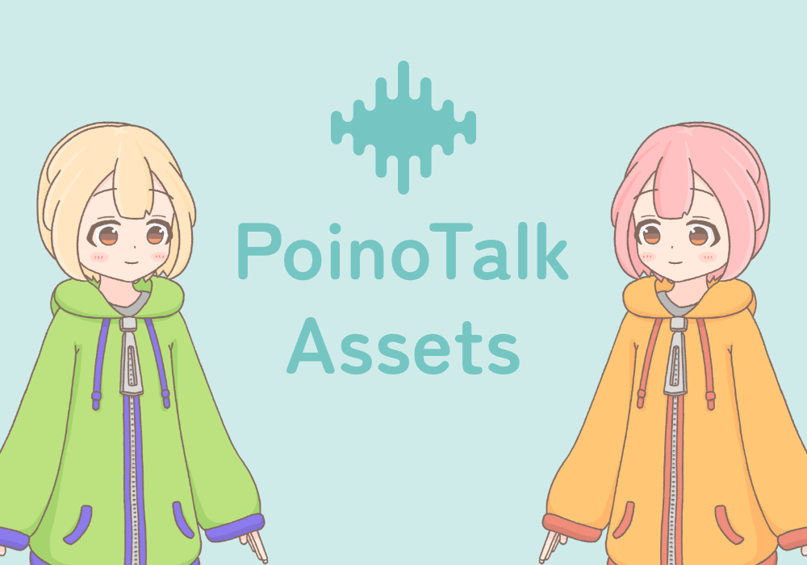

# PoinoTalk Assets

PoinoTalk関連のアセット  

## フォルダ/ファイルの説明

### release フォルダ
主にリリース用に最適化されたアセットが入っています  
公式で配布されているアセットが欲しいという方はこちらをご利用ください  

### original フォルダ
主にリリース用アセットを制作するためのデータが入っています  
立ち絵などはリリースフォルダのものよりレイヤーが細かくなっていたりします  
公式で配布されている素材を改変したいという方はこちらを利用したほうが細かく改変できます  

### psd ファイル
レイヤーがグループが含まれる画像ファイルです  
Photoshop (有料) やFireAlpaca (無料) などで開くことができます  
一部、PSDToolにも対応しています  

### afdesign ファイル
Affinity Designer (有料) で開くことができる画像ファイルです  

## ダウンロード
すべてを一括でダウンロードする方法と、個別にダウンロードする方法があります  

1. 緑色のCodeボタンからDownload ZIPを選択してすべてのアセットを一括でZIPファイルでダウンロードする
1. ファイル名をクリックしてからダウンロードアイコンのボタン (Download raw file) を押して個別のファイルでダウンロードする

## 注意事項
- 必ずライセンス (利用規約) を読み、ライセンスに沿ってご利用ください
- ライセンスで不明な点については、ライセンスQ&Aをご参照ください
- cover.png は PoinoTalk Licence 1.0 の対象外です
- cover.png には Open Font License の Zen Maru Gothic フォントを使用しています

## ライセンス
PoinoTalk Licence 1.0  
https://raw.githubusercontent.com/KoharuYuzuki/PoinoTalkLicence/main/1.0.txt  

ライセンスQ&A  
https://github.com/KoharuYuzuki/PoinoTalkLicence?tab=readme-ov-file#qa  

## 連絡先
Twitter: https://twitter.com/KoharuYuzuki25  

## Q&A

### Q. こんなアセットを制作して追加して欲しい
A. すべて対応できるわけではありませんが、可能な限り対応したいと思っています  
ぜひお気軽にご連絡ください  
ご連絡はTwitterかGitHubのIssueでお願いします  
また、「〇〇のアセットを作ったのでこのリポジトリに追加して欲しい」といったご要望には対応できません  
